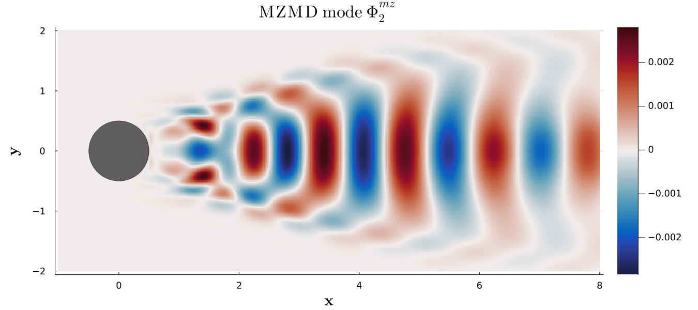
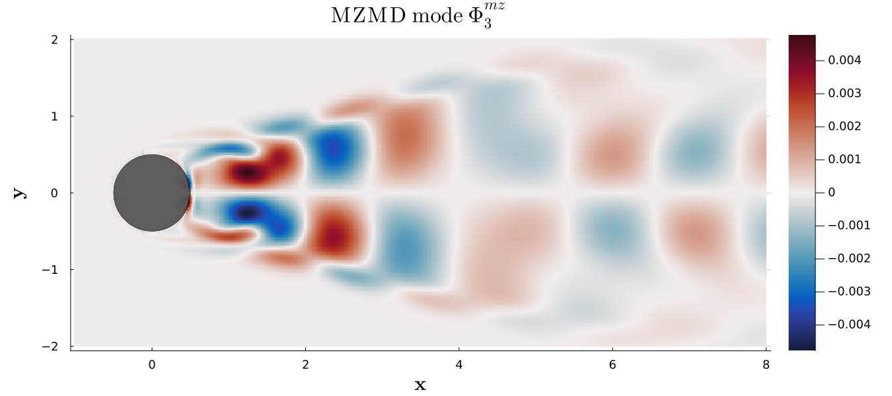
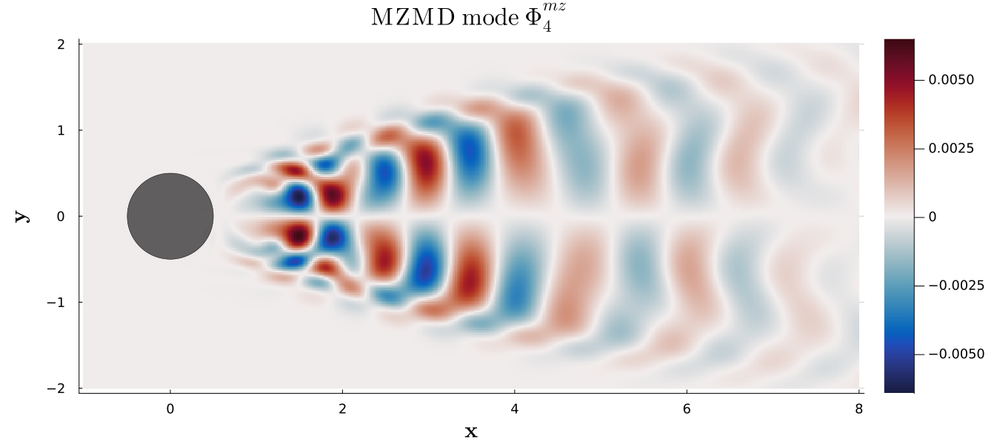
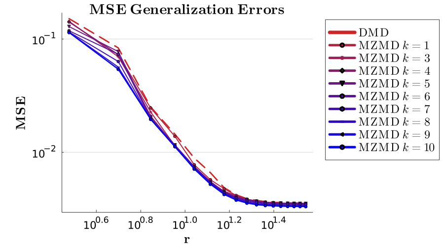
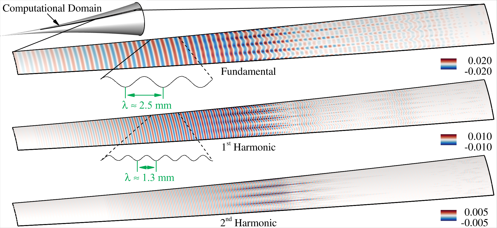

# Mori-Zwanzig Modal Decomposition (MZMD)

This repository contains the source codes for the manuscript "Mori-Zwanzig Modal Decomposition". The source codes were reviewed and approved with a LANL O-number O4678.

### Description
MZMD is a juila module that includes the algorithms for learning the linear MZ operators $ \bm \Omega^{(x)}_i$ from data and extracting the large-scale spatio-temporal structures contained in the state space Generalized Langevin Equation (GLE):  
$$
    \bm x_{n+1} = \bm \Omega^{(x)}_0 \bm x_n + ... + \bm \Omega^{(x)}_n \bm x_{0} + W_n(x_0).
$$

MZMD represents a generalization of the DMD algorithm [[1]](#1) by including MZ memory (which satisfies the generalized fluctuation dissipation theorem) for nearly the same computational cost.  MZMD with no memory (i.e. $ k=0$) is equivalent to DMD, and adding memory only marginally increases the computational cost (by roughly 1\% for every 10 memory kernels added). For more details, see our paper https://arxiv.org/abs/2311.09524 for the MZMD algorithms and derivations and see https://epubs.siam.org/doi/abs/10.1137/21M1401759 for the detailed theoretical construction and analysis of the data-driven MZ approach (titled: "Data-Driven Learning for the Mori--Zwanzig Formalism: A Generalization of the Koopman Learning Framework").

### Installation
The Julia programming languange (https://julialang.org/) was designed for high performance scientific computing. The instructions for downloading Julia can be found in https://julialang.org/downloads/. Once Julia is installed, this package can be downloaded as follows. You can run julia in command line (REPL), or in vscode (which is a convient to use IDE) as described in https://code.visualstudio.com/docs/languages/julia

Within the julia REPL (which can be accessed by typing "julia" in the command line), download this package via
>] add MoriZwanzigModalDecomposition

or with
> import Pkg; Pkg.add("MoriZwanzigModalDecomposition")

### Basic usage: 2D flow over a cyclinder  at $Re = 200$
First, the data of states or measurements $\bm x_i \in \mathbb{R}^m$ must be arranged into the snapshot matrix:
$$ \bm X = [\bm x_1, ..., \bm x_n] \in \mathbb{R}^{m\times n}$$

Here we use a vorticity data-set of a 2D flow over a cyclinder in order to demonstrate the basic usage of MZMD for modal analysis and reduced order modeling. This data-set was generated from the open source immersed boundary method https://github.com/cwrowley/ibpm/ of Taira and Colonius [[2]](#2), [[3]](#3).

The figures below show an application of the MZMD method for the flow over a 2D cylinder at $Re=200$:

Looking at the generalization errors of predicting the future state evolution of the 2D cyclinder flow as we vary $r$ and increase memory length $k$ we see that MZMD improves future state prediction by adding MZ memory:

We see an even greater improvement of MZMD over DMD when there are strong nonlinearities present such as those found in transitional boundary layer flows (https://arxiv.org/abs/2311.09524). The figure below shows the MZMD modes for the pressure disturbuances of a Mach 6 flow over a flared cone.

### Running the code:
The mzmd_cyclinder.jl file provides a basic example of running MZMD and plotting the results. Frist, select the number of MZ operators to use with the n_ks parameter. n_ks = 1 is the same as DMD (only the Markovian operator from MZ is used). n_ks >=2 uses MZ memory. r is the rank to use in low rank approximation using SVD or Method of Snapshots. The modes of MZMD and DMD are plotted and compared. 

## Key takaways

- Easy to incorporate with existing DMD algorithms (MZMD Markovian term is equivalent to DMD).
- Including MZ memory can improve accuracy of future state prediction, especially in regions of strong nonlinearities.
- Roughly the same computational cost as DMD (scaling dominated by SVD).
- Includes memory effects from MZ memory kernels, without the costly time-delay embeddings.
- Time delay embeddings and MZ memory are not mutually exclusive; adding both can improve accuracy over EDMD. 
- Many future oppurtunities to incorporate MZ memory with existing approximate Koopman learning techniques.

### References
<a id="1">[1]</a>
Kutz, J. Nathan and Brunton, Steven L. and Brunton, Bingni W. and Proctor, Joshua L. (2016).
Dynamic Mode Decomposition. Society for Industrial and Applied Mathematics, 10.1137/1.9781611974508

<a id="2">[2]</a>
K. Taira and T. Colonius. The immersed boundary method: A projection approach. J. Comput. Phys., 225(2):2118-2137, August 2007.

<a id="3">[3]</a>
T. Colonius and K. Taira. A fast immersed boundary method using a nullspace approach and multi-domain far-field boundary conditions. Comp. Meth. Appl. Mech. Eng., 197(25-28):2131–46, 2008.

### Citation
Please cite this work if used

@misc{woodward2023morizwanzig,
      title={Mori-Zwanzig Modal Decomposition}, 
      author={Michael Woodward and Yifeng Tian and Yen Ting Lin and Christoph Hader and Hermann Fasel and Daniel Livescu},
      year={2023},
      eprint={2311.09524},
      archivePrefix={arXiv},
      primaryClass={physics.flu-dyn}
}